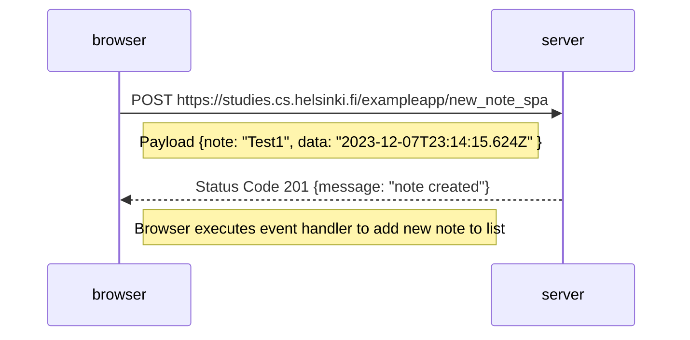

```mermaid
sequenceDiagram
    participant browser
    participant server

    browser->>server: POST https://studies.cs.helsinki.fi/exampleapp/new_note_spa
    Note right of browser: Payload {note: "Test1", data: "2023-12-07T23:14:15.624Z" }

    server-->>browser: Status Code 201 {message: "note created"}
    Note right of browser: Browser executes event handler to add new note to list
```
